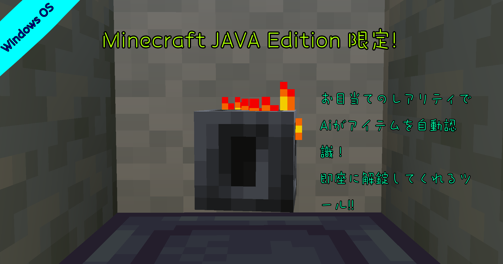

> [!No Hack.]
> # Modやデータパックに頼らないシステム
<h1 align="center">
  </a>
  <b>Minecraft Ominous_vault_Container Tool</b>
   
  <b>-For Java Edition-</b>
   
</h1>

  Create.2025 Made by DonutSuZu</a>.
   

## 最新版
こちら: [releases page](https://github.com/PrincessSaKuRa/ACNL-AION-Plugin/releases)

## サポート OS
Windows 11 home

## 要求環境
Python3.13.5/ultralytics

## 使い方
リソースパックを適用し、影modなどをオフにしてください!

## 1:目的の宝物庫に到着したら、宝物庫が頭の前に来るように、場所によっては相場を一つ掘り下げて作ります。
## ニマス：宝物庫 ←目線
## 一マス:　　　　　胴体
## 2:視野を50に設定し、宝物庫の後ろが白色の羊毛ブロックにします(しなくても反応しますが、したほうが精度が上がります。)
## 3:ラインナップとして表示されるアイテムが真ん中にくるように視点を調整します。
## 4:不吉な鍵を持った状態で、F1キーを押したら、core.pyを動作確認と同じ要領で起動します。
## 注:ESCキーを押すと動作が停止します。インベントリを閉じるときはインベントリ開閉キーで閉じてください。
## 5:あとは待つだけです。

## 注意
必ず狙ったアイテムがでるとは限りません。
レアリティに準じたアイテムがランダムで排出されます。ヘビーコアを狙ったときに、同レアリティのエンチャント金リンゴがでる可能性もあります。

## 禁止行為
･自作発言 　
･二次配布及び元の透過データそのものを転売･公表する行為 　
･本データを使用しての法律･公序良俗に反する行為 　
･その他、著作権者:DonutSuZuが不適切と判断する行為 確認事項および禁止行為につきましては予告なく変更する場合がございます。予めご了承ください。

## テスト環境
Minecraft Java Edition 1.21.5 [Iris/Sodium]
Windows 11 home,
CPU:i7 9700k/Nvidia Geforce RTX2080 ti
RAM:DDR4 16GB
SSD 1TB
JAVA-21/Python-3.13.5
